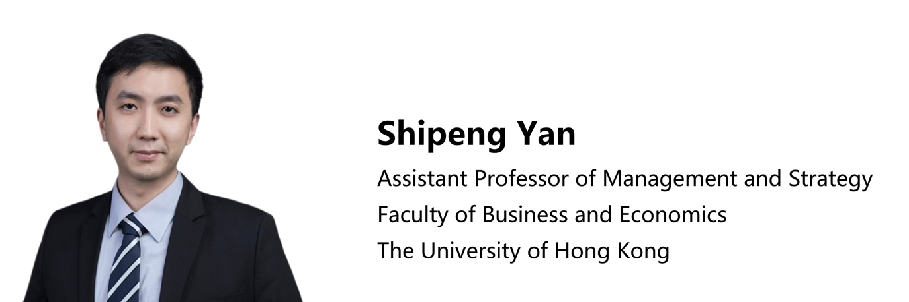

## Bio
My expertise lies in corporate sustainability, ESG, and institutional analysis. With training in organization theory, I have a PhD in Management from the IESE Business School in Spain and a Bachelor's in Business Administration (Information Systems) from the University of Hong Kong. 

## Lastest News
* Jan-Feb, 2025: Received two revision requests from **UTD journals** 
* 2024: Received five revision requests from **UTD journals**
* 2023: Received two revision requests from **UTD journals**
* Aug, 2023: Received Emerging Scholar Award from Org and Natural Environment Division of AOM
* Jun, 2023: Invited to be Senior Editor for Management and Organization Review
* Jul, 2022: Invited to be Deputy Editor for Organization and Environment

## Major Publications

My research falls into two broad themes. In the first research stream (papers 4-5), I follow an “outside-in” perspective, examining external factors that surround business corporations and employing an institutional theory lens to understand the underlying drivers, mechanisms, and impacts of corporate sustainability. In my second research stream (papers 1-3), I take an “inside-out” perspective, researching internal strategic choices from within business corporations to understand their impacts on the relevant stakeholders and the broader society.

1. Cai Yishu, Yue Qingyuan (Lori), Lin Fangwen, **Yan Shipeng**, Yang Haibin (equal authorship). (forthcoming). “Sunflower movement and corporate donations”. **Administrative Science Quarterly**.
2. Maksimov Vladislav, Wang Lu Stephanie, **Yan Shipeng** (equal authorship). 2022. “Global connectedness and dynamic green capabilities in MNEs”. **Journal of International Business Studies**, 53(4): 723-740. 
3. **Yan Shipeng**, Almandoz Juan (John), Ferraro Fabrizio. 2021. “The Impact of Logic (In)Compatibility: Green Investing, State Policy, and Corporate Environmental Performance”. **Administrative Science Quarterly**,66(4): 903-944.
4. **Yan Shipeng**. 2020. “A double-edged sword: Diversity within religion and market emergence”. **Organization Science**, 31(3): 558-575. 
5. **Yan Shipeng**, Ferraro Fabrizio, Almandoz Juan (John). 2019. “The rise of socially responsible investment funds: The paradoxical role of the financial logic”. **Administrative Science Quarterly**, 64(2): 466–501

## Other Publications
* Fu Jiawei, Yan Shipeng. Forthcoming. “How Do New Forms of Organizations Manage Institutional Voids? Social Enterprises’ Quest for Sociopolitical Legitimacy”. Business & Society.
* Zhang, Ze, Yan Shipeng. 2023. “Air pollution and investors’ behavior: A review of recent literature.” The Routledge Handbook of Green Finance: 542–562. London and New York: Routledge.
* Yan, Shipeng, Ferraro Fabrizio. 2016. “State mediation in market emergence: Socially responsible investing in China”. Research in the Sociology of Organizations, vol. 48B: 173–206. Bingley: Emerald Group Publishing Limited.
* Bose Indranil, Yan Shipeng. 2011. “The green potential of RFID projects: A case-based analysis”. IT Professional, 13(1).

## Working papers
#### Corporate sustainability: 
* Corporate reputation and environmental expenditure (under review)
* Religion and corporate decarbonization (under review)
  
* Anti-slavery regulation and supply chain management (under review)
* ESG investors and supplier hiding (under review)

* ESG ratings and investor reactions (under review)
* ESG investing and carbon re-allocation (under review)
* Banks and environmental innovation (preparing for submission)
* Climate litigation (writing)

#### Corporate non-market strategy
* Social movement and consumer evaluation (preparing for submission)
* Religion and corporate de-leveraging (writing)
* Rhetorics and Bitcoin emergence (under review)
* Institutional trust and Bitcoin (writing)

I am open to collaborations and please don't hesitate to drop an email at shpyan at hku dot hk if you find an overlapping interest. 

## For Visiting students & PhD applicants
#### PhD Admission at HKU Business School
I regularly receive emails soliciting my interest in hiring PhD students, but this is unnecessary. In my current institution, PhD admission decisions in our area are committee-based. However, if you are already a doctoral student interested in ESG and institutional analysis from a different institution, there might be a visiting opportunity. 

#### My style as a PhD adviser
* My goal is to help you become an independent and productive scholar. I am not a micro-manager and tend to push you to do anything. However, if you believe that sometimes a healthy dose of structure with reminders and deadlines is helpful for you, please ask for it from me explicitly. 
* I respcet your boundaries and understand that you have multiple priorities in life. I don't think research is the most important thing in life. It is unlikely that you will receive a message from me on holidays and weekends.
* In general, I am responsive. In return, I also expect you to be responsive. 
* You don't have to agree with me all the time, but you should provide a well-reasoned explanation. This principle applies to responding to reviewers.
* I am on your side when you need support. That means I am with you even if you decide that research is not your cup of tea. However, you should take the initiative to communicate your concerns in a timely manner. 

#### My intellectual style
As a management scholar, I care about theoretical novelty, empirical rigor, and practical relevance. A good paper should at least have one of these three elements.

#### Why PhD in Management?
1. You will NOT become a CEO of a large multinational firm after doing a PhD in management. Doing this will most likely kill your chance to be a CEO. An imperfect but useful analogy is that a management scholar is to a manager as a football game analyst is to a footballer.

 

2. Management research treats managerial phenomena as if they can be scientifically analyzed and generalized and develop abstract theories to describe complex managerial issues in simple ways. Sometimes certain scholars go too far in developing theories on phenomena that few people care about. Sometimes certain scholars are not careful in developing explanations that are logically coherent and scientifically rigorous. Management research must balance between academic rigor and practical relevance. 

 

3. As a management scholar, you will have the opportunity to help train and educate the next generation of corporate leaders. Future and current managers love to go back to business schools to reflect on their past experiences and learn from your research if it is interesting and relevant.

